# Big Data Assignment: Ford GoBike System Guide

## Introduction
This guide provides instruction to set up the Ford GoBike analytic application which is a big data platform designed to scale as the bike sharing scheme expands to cover more area across the states.

In a nutshell, the input and output of the system are:
* source data is provided by Ford GoBike at their [website](https://www.fordgobike.com/) via this [link](https://www.fordgobike.com/system-data)
* visualisation is hosted on carto.com at this [link](https://e0015358.carto.com/builder/cb097103-cd70-4d53-a749-627bad91fa95/embed).

## System Overview
For the demo, the system is put together in a VirtualBox VM with Ubuntu OS. The system covers 
* ingestion of the data using Apache Flume
* storage in HDFS
* processing using Spark RDD and GraphX
* analysis and visualisation using [Carto](https://carto.com/)

The source codes are available at github.

## Components
The system comprises the following components:

Component | Version | Website | Purpose
--------- | ------- | ------- | -------
Oracle VirtualBox | 5.2.8 | https://www.virtualbox.org | Host the VMs for the demo
Ubuntu Server | 16.04.4 LTS | https://www.ubuntu.com | Where the big data components are installed
Java 8 JDK | 1.8.0_151 | https://java.com/en |
Apache Zookeeper | 3.4.11 | http://zookeeper.apache.org | Coordinate distributed systems, required for Hadoop and Flume
Apache Hadoop | 2.7.5 | http://hadoop.apache.org | Comprise HDFS and Yarn
Apache Flume | 1.8.0 | http://flume.apache.org | To ingest the trip logs and deposit into HDFS
Apache Spark | 2.3.0 | http://spark.apache.org | To process the file and use GraphX for the graph analysis
SBT	| 1.1.1 | https://www.scala-sbt.org | Build tool for Scala

Other components installed but not use in the demo:

Component | Version | Website | Purpose
--------- | ------- | ------- | -------
HBase | 1.2.6 | https://hbase.apache.org | A distributed and scalable data store
Kafka | 1.0.1 | http://kafka.apache.org | For publishing and subscribing to messages 
Zeppelin | 0.7.3 | https://zeppelin.apache.org | A web-based notebook for interactive data analytics with Scala and more

## Installation
Please install the components in the order presented in this guide.

### VirtualBox
1. Download and install the latest VirtualBox binaries from https://www.virtualbox.org/wiki/Downloads. After installing. launch VirtualBox to start creating an Ubuntu virtual machine.
1. Click _New_ to create a virtual machine
1. In the dialog box, enter as follow and click _Next_\
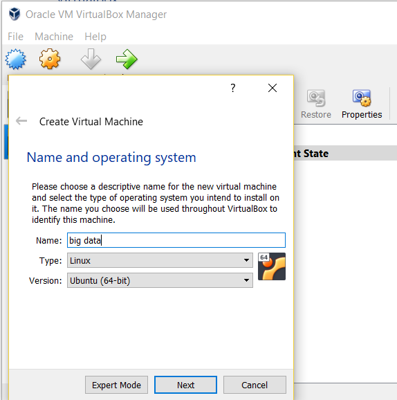
1. Set the memory size to 4096 MB and click _Next_
1. Select _Create a virtual hard disk now_ and click _Create_\
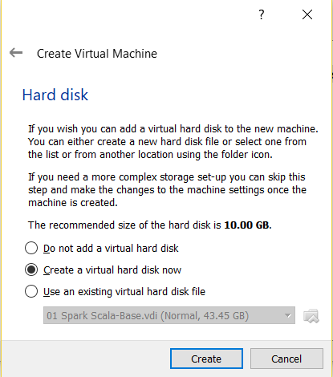
1. Select _VDI (VirtualBox Disk Image)_ and click _Next_
1. Select _dynamically allocated_ and click _Next_
1. Take the default name of the virtual hard disk and increase the size to 20 GB, click on the icon next to the name and select the directory to store the file, preferably in a large enough hard disk. Finally, click _Create_.\
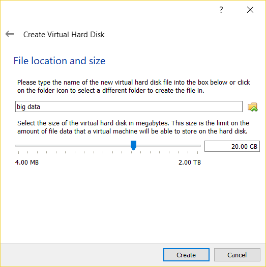
1. Click _Settings_ -> _Network_. Enable _Adapter 1_, select _Host-only Adapter_ and enable _Adapter 2_ and select _Nat Network_. Click _OK_ to complete the network setup.

### Ubuntu Server
The following instruction is based on this link https://topnetworkguide.com/install-ubuntu-server-16-04-virtual-box/
1. Download Ubuntu Server 16.04.4 LTS from https://www.ubuntu.com/download/server
1. Then return to VirtualBox, select _big data_ and click _Settings_ -> _Storage_
1. Under _Controller: IDE_, select _Empty_ then click on the disk icon on the right and select the iso image of the Ubuntu Server that was downloaded in step 1 above. Click _OK_.\
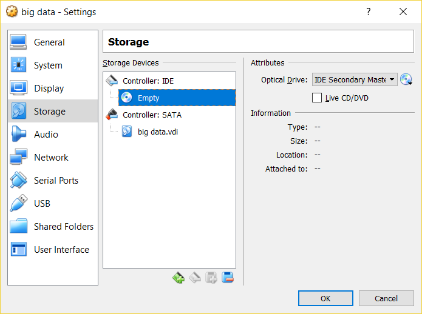
1. Click _Start_ to power up the VM.
1. The first screen you see on boot up is language. Select _English_.\
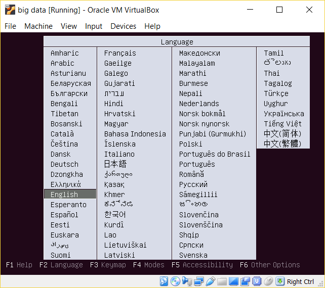
1. Click _Install Ubuntu Server_.\
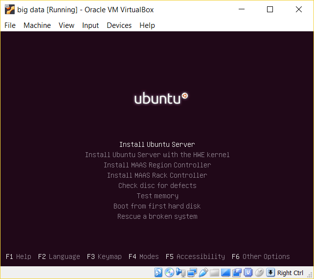
1. Select _English_ as the language the system will be setup with and select _Singapore_. Configure the keyboard layout.
1. The system proceeds to configure the network interfaces and the likes. Choose _enp0s8_ as the primary network interface.\
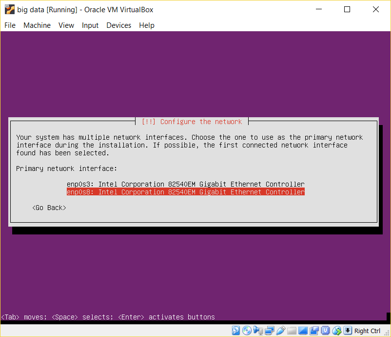
1. After the network interface has been configured successfully, you will be presented with the screen below. Enter the hostname for the machine as _ubuntu_. If the network interface is not successfully set up, repeat step 8 with the other network interface.\
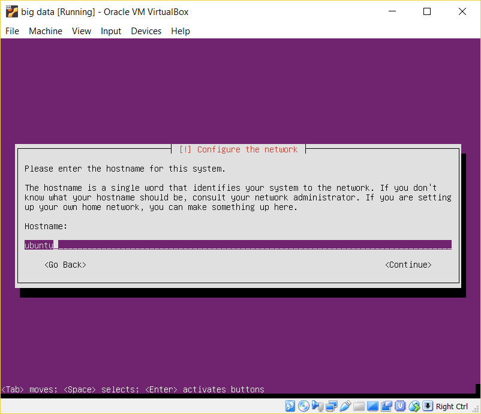
1. Enter _bigdata_ as the username and _bigdata2018_ as the password.
1. In the setup user screen, choose _No_ to encrypting the home directory since this is a lab environment.
1. Choose _Singapore_ timezone.
1. In the partition disk, click _use entire disk and set up lvm_. Hit enter two times, click _Yes_ to writing changes. In the partition disk, hit continue and click _Yes_.\
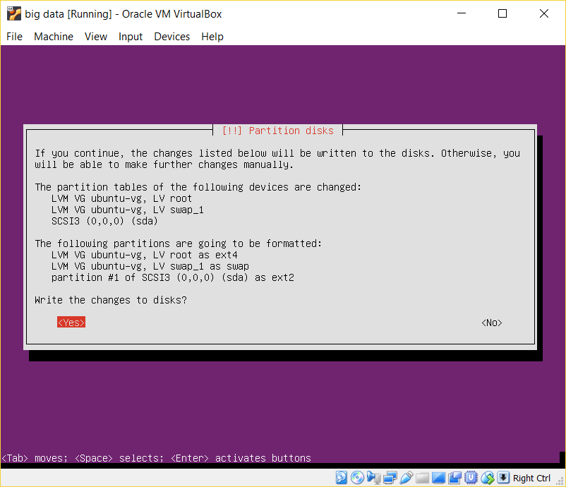
1. Now the system will begin installation. This will take a while to complete.\
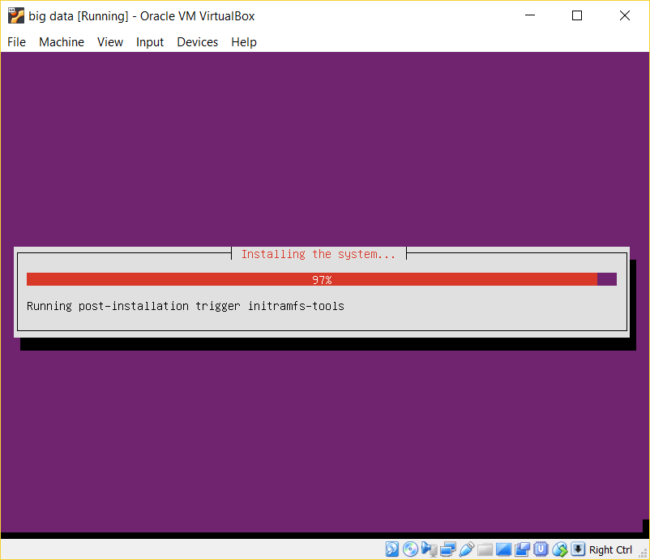
1. Leave blank and click _Continue_\
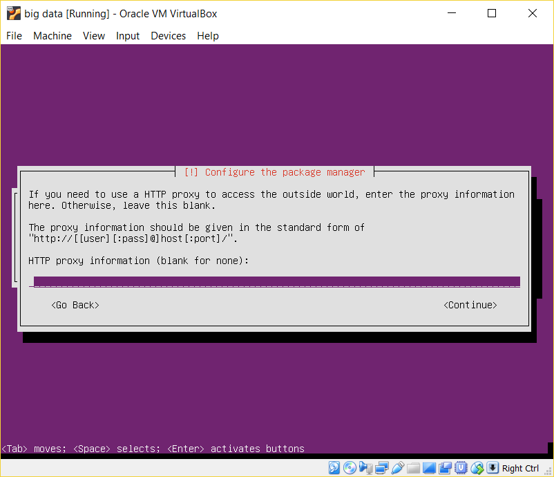
1. Wait for the setup to complete\

1. Click on _no automatic update_ as it will be done manually.
1. Accept the defaults as we do not need the server to perform these functions.\

1. Click _Yes_ to install grub bootloader to mbr as it is the only OS on the virtual machine.
1. At this point, you will be asked to reboot your system because the installation has been completed.\
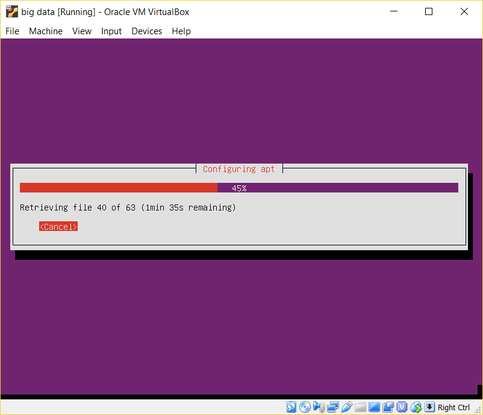

### Configure Virtual Machine
The following instruction is based on these links https://www.tecmint.com/network-between-guest-vm-and-host-virtualbox/ and https://unix.stackexchange.com/questions/145997/trying-to-ssh-to-local-vm-ubuntu-with-putty to enable communication between the host and the virtual machines. This is required to be able to launch Zeppelin from the host machine. No static IP is configured as we are not certain if it will work between home and ISS network.
1. Install [Putty](https://www.putty.org/) on the host PC so that you can have multiple SSH sessions into the guest VM. 
1. Configure the network interface in the guest VM
   1. Launch and log in into Ubuntu
   1. Edit /etc/network/interfaces
```
      sudo vi /etc/network/interfaces
```
      Append the following entries:
```
      auto enp0s3
      iface enp0s3 inet dhcp
```
   1. Restart the network interfaces 
```
      sudo systemctl restart networking
```
1. Install the ssh server in the guest VM
```
sudo apt-get install openssh-server
```

### Java JDK
The following instruction is based on this link https://www.digitalocean.com/community/tutorials/how-to-install-java-with-apt-get-on-ubuntu-16-04. As of this writing, the version installed is OpenJDK 8. Install JDK instead of JRE to have jps utility.
1. Update the package index
```
sudo apt-get update
```
1. Install the Java Runtime Environment (JDK)
```
sudo apt-get install default-jdk
```
1. Setting the JAVA_HOME Environment Variable
   1. To set this environment variable, we will first need to find out where Java is installed. You can do this by executing the same command as in the previous section:
```
      sudo update-alternatives --config java
```
   1. Copy the path and then open /etc/environment
```
      sudo vi /etc/environment
```
   1. At the end of this file, add the following line, making sure to replace the highlighted path with your own copied path.
```
      JAVA_HOME="/usr/lib/jvm/java-8-openjdk-amd64"
```
   1. Save and exit the file and reload it.
```
      source /etc/environment
```
   1. You can now test whether the environment variable has been set by executing the following command:
```
      echo $JAVA_HOME
```

### Hadoop, Yarn, HDFS
The following instruction is based on these links:
- https://www.digitalocean.com/community/tutorials/how-to-install-hadoop-in-stand-alone-mode-on-ubuntu-16-04
- http://techsphot.com/set-up-hadoop-in-pseudo-distributed-mode-on-ubuntu/
- https://www.tutorialspoint.com/hadoop/hadoop_enviornment_setup.htm

Hadoop is installed in pseudo distributed mode. The version to install is 2.7.5.

1. Download the Hadoop distribution in the server as follows:
```
cd ~
mkdir downloads
cd downloads
wget http://archive.apache.org/dist/hadoop/common/hadoop-2.7.5/hadoop-2.7.5.tar.gz
```
1. Untar the file and move the extracted files to /opt/hadoop
```
tar -xzvf hadoop-2.7.5.tar.gz
sudo mv hadoop-2.7.5 /opt/hadoop
```
1. Set Hadoop environment variables by appending the following commands to ~/.bashrc file.
```
export HADOOP_HOME=/opt/hadoop 
export HADOOP_MAPRED_HOME=$HADOOP_HOME 
export HADOOP_COMMON_HOME=$HADOOP_HOME 
export HADOOP_HDFS_HOME=$HADOOP_HOME 
export YARN_HOME=$HADOOP_HOME 
export HADOOP_COMMON_LIB_NATIVE_DIR=$HADOOP_HOME/lib/native 
export PATH=$PATH:$HADOOP_HOME/sbin:$HADOOP_HOME/bin 
export HADOOP_INSTALL=$HADOOP_HOME
```
Now apply all the changes into the current running system.
```
source ~/.bashrc
```
1. Configure Hadoop configuration files in the /opt/hadoop/etc/hadoop. 
   1. core-site.xml
The core-site.xml file contains information such as the port number used for Hadoop instance, memory allocated for the file system, memory limit for storing the data, and size of Read/Write buffers. Open the core-site.xml and add the following properties in between <configuration>, </configuration> tags.
```
   <property>
      <name>fs.default.name</name>
      <value>hdfs://localhost:9000</value> 
   </property>
```
   1. hdfs-site.xml
The hdfs-site.xml file contains information such as the value of replication data, namenode path, and datanode paths of your local file systems. It means the place where you want to store the Hadoop infrastructure. Open this file and add the following properties in between the <configuration> </configuration> tags in this file.
```
   <property>
      <name>dfs.replication</name>
      <value>1</value>
   </property>

   <property>
      <name>dfs.name.dir</name>
      <value>file:///home/bigdata/hadoopinfra/hdfs/namenode </value>
   </property>
    
   <property>
      <name>dfs.data.dir</name> 
      <value>file:///home/bigdata/hadoopinfra/hdfs/datanode </value> 
   </property>
```       
   1. yarn-site.xml
This file is used to configure yarn into Hadoop. Open the yarn-site.xml file and add the following properties in between the <configuration>, </configuration> tags in this file.
```
   <property>
      <name>yarn.nodemanager.aux-services</name>
      <value>mapreduce_shuffle</value> 
   </property>
```  
   1. mapred-site.xml
This file is used to specify which MapReduce framework we are using. By default, Hadoop contains a template of yarn-site.xml. First of all, it is required to copy the file from mapred-site.xml.template to mapred-site.xml file using the following command.
```
cp mapred-site.xml.template mapred-site.xml
```
Open mapred-site.xml file and add the following properties in between the <configuration>, </configuration>tags in this file.
```
   <property> 
      <name>mapreduce.framework.name</name>
      <value>yarn</value>
   </property>
```   
1. Set up namenode
```
cd ~ 
hdfs namenode -format
```
1. Verify Hadoop dfs and yarn script
```
start-dfs.sh
start-yarn.sh
```
1. Check that the processes are started successfully:
```
bigdata@ubuntu:~$ jps
6707 Jps
6150 SecondaryNameNode
6295 ResourceManager
5817 NameNode
6428 NodeManager
5966 DataNode
```
1. Accessing Hadoop on browser on the host machine
The default port number to access Hadoop is 50070. Use the following url to get Hadoop services on browser.
```
http://192.168.56.102:50070/
```
1. Verify All Applications for Cluster
The default port number to access all applications of cluster is 8088. Use the following url to visit this service.
```
http://192.168.56.102:8088/
```
1. Stop dfs and yarn script
```
stop-yarn.sh
stop-dfs.sh
```

### SBT
The following instruction is based on this link https://www.scala-sbt.org/1.0/docs/Setup.html
1. Run the following commands to install sbt
```
echo "deb https://dl.bintray.com/sbt/debian /" | sudo tee -a /etc/apt/sources.list.d/sbt.list
sudo apt-key adv --keyserver hkp://keyserver.ubuntu.com:80 --recv 2EE0EA64E40A89B84B2DF73499E82A75642AC823
sudo apt-get update
sudo apt-get install sbt
```

### Scala
The following instruction is based on this link https://medium.com/@josemarcialportilla/installing-scala-and-spark-on-ubuntu-5665ee4b62b1
1. Run the following commands to install scala
```
sudo apt-get install scala
```
1. Start the scala shell
```
scala
```
1. You should see the scala REPL running. Test it with:
```
println(“Hello Word”)
```
1. Exit the shell
```
:q
```

### Apache Spark
The following instruction is based on this link https://medium.com/@josemarcialportilla/installing-scala-and-spark-on-ubuntu-5665ee4b62b1
1. Go to https://spark.apache.org/downloads.html and download a pre-built for Hadoop 2.7 version of Spark (preferably Spark 2.0 or later). Then download the .tgz file. Note that the link below may be different as it depends on the mirror that the download page directs to.
```
wget http://www-eu.apache.org/dist/spark/spark-2.3.0/spark-2.3.0-bin-hadoop2.7.tgz
```
1. Untar the file and move the extracted files to /opt/spark
```
tar -xzvf spark-2.3.0-bin-hadoop2.7.tgz
sudo mv spark-2.3.0-bin-hadoop2.7 /opt/spark
```
1. Open the spark shell to verify the setup is successful.
```
cd /opt/spark/bin
./spark-shell
```
1. Test it with:
```
println(“Spark shell is running”)
```
1. Exit the shell
```
:q
```

### Apache Flume
The following instruction is based on this link https://www.tutorialspoint.com/apache_flume/apache_flume_environment.htm
1. Go to https://flume.apache.org/download.html and download a flume. Note that the link below may be different as it depends on the mirror that the download page directs to.
```
wget http://www-eu.apache.org/dist/flume/1.8.0/apache-flume-1.8.0-bin.tar.gz
```
1. Untar the file and move the extracted files to /opt/flume
```
tar -xzvf apache-flume-1.8.0-bin.tar.gz 
sudo mv apache-flume-1.8.0-bin /opt/flume
```
1. In the .bashrc file, set the home folder, the path, and the classpath for Flume as shown below.
```
export FLUME_HOME=/opt/flume
export PATH=$PATH:$FLUME_HOME/bin
export CLASSPATH=$CLASSPATH:$FLUME_HOME/lib/*
```
1. Make copies of these property files:
```
cp flume-conf.properties.template flume-conf.properties
cp flume-env.sh.template flume-env.sh
```
1. Verify the installation by running this command
```
flume-ng
```
You should see this output:
```
bigdata@ubuntu:~$ flume-ng
Error: Unknown or unspecified command ''

Usage: /opt/flume/bin/flume-ng <command> [options]...

commands:
  help                      display this help text
  agent                     run a Flume agent
  avro-client               run an avro Flume client
  version                   show Flume version info
```

Zeppelin
http://zeppelin.apache.org/docs/0.7.3/install/install.html
Move to /usr/local/zeppelin
If you are configuring auto start, note the path to zeppelin
http://192.168.56.101:8080
ZooKeeper
https://www.tutorialspoint.com/zookeeper/zookeeper_installation.htm
zookeeper-3.4.11.tar.gz
/opt/zookeeper
make a copy of zoo.cfg from zoo_sample.cfg in /opt/zookeeper/conf
change dataDir=/home/bigdata/data/zookeeper
sudo mkdir /opt/zookeeper/logs
update log4j.properties zookeeper.log.dir, zookeeper.tracelog.dir to /opt/zookeeper/logs
Apache HBase
Download from https://hbase.apache.org/, stable release hbase-1.2.6-bin.tar.gz
Configure https://www.tutorialspoint.com/hbase/hbase_installation.htm
Note that the path to store the name nodes is /home/bigdata instead of /home/hadoop
Turn off hbase managing zookeeper
export HBASE_MANAGES_ZK=false
Kafka
https://devops.profitbricks.com/tutorials/install-and-configure-apache-kafka-on-ubuntu-1604-1/
kafka_2.11-1.0.1.tgz
/opt/kafka
sudo mkdir /opt/kafka/logs
export LOG_DIR=/opt/kafka/logs
sudo nohup /opt/kafka/bin/kafka-server-start.sh /opt/kafka/config/server.properties /tmp/kafka.log 2>&1 
https://kafka.apache.org/quickstart

Start Stop System
Start
Start-all.sh
Jps to ensure all the components are up and running
Stop 
Stop-all.sh to stop all process
Essential Information
VM IP	192.168.56.102
User ID / Password	bigdata / bigdata2018
	
	

