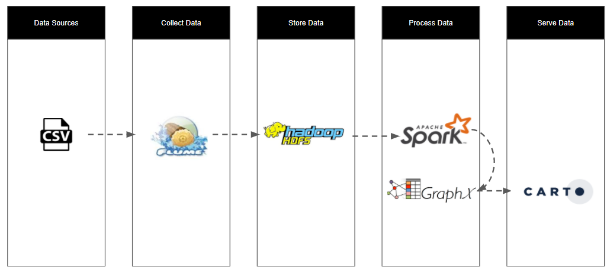

# Big Graph Data Analysis in Spark: Ford GoBike

## Introduction
This guide provides instruction to set up the Ford GoBike analytic application which is a big data platform designed to scale as the bike sharing scheme expands to cover more area across the states.

Here we attempt to use GraphX to model the BikeShare data from [Ford GoBike](www.fordgobike.com/system-data)

In a nutshell, the input and output of the system are:
* source data is provided by Ford GoBike at their [website](https://www.fordgobike.com/) via this [link](https://www.fordgobike.com/system-data)
* visualisation is hosted on carto.com at this [link](https://e0015358.carto.com/builder/cb097103-cd70-4d53-a749-627bad91fa95/embed).

See here for [essential information](./docs/guide/30-essential.md) about the setup.

## System Overview
For the demo, the system is put together in a VirtualBox VM with Ubuntu OS. The system covers 
* ingestion of the data using Apache Flume
* storage in HDFS
* processing using Spark RDD and GraphX
* analysis and visualisation using [Carto](https://carto.com/)

The source codes are available at [github](https://github.com/ebyeo/bigdata).

## Components
The system comprises the following components:

Component | Version | Website | Purpose
--------- | ------- | ------- | -------
Oracle VirtualBox | 5.2.8 | https://www.virtualbox.org | Host the VMs for the demo
Ubuntu Server | 16.04.4 LTS | https://www.ubuntu.com | Where the big data components are installed
Java 8 JDK | 1.8.0_151 | https://java.com/en |
Apache Zookeeper | 3.4.11 | http://zookeeper.apache.org | Coordinate distributed systems, required for Hadoop and Flume
Apache Hadoop | 2.7.5 | http://hadoop.apache.org | Comprise HDFS and Yarn
Apache Flume | 1.8.0 | http://flume.apache.org | To ingest the trip logs and deposit into HDFS
Apache Spark | 2.3.0 | http://spark.apache.org | To process the file and use GraphX for the graph analysis
SBT	| 1.1.1 | https://www.scala-sbt.org | Build tool for Scala

Other components installed but not use in the demo:

Component | Version | Website | Purpose
--------- | ------- | ------- | -------
HBase | 1.2.6 | https://hbase.apache.org | A distributed and scalable data store
Kafka | 1.0.1 | http://kafka.apache.org | For publishing and subscribing to messages 
Zeppelin | 0.7.3 | https://zeppelin.apache.org | A web-based notebook for interactive data analytics with Scala and more

## Installation
Please install the components in the order presented in this guide:

* [Install VirtualBox](./docs/guide/01-virtualbox.md)
* [Install Ubuntu](./docs/guide/02-ubuntu.md)
* [Configure Virtual Machine](./docs/guide/03-configure-virtualbox.md)
* [Install Java JDK](./docs/guide/04-java.md)
* [Install Hadoop, Yarn, HDFS](./docs/guide/05-hadoop.md)
* [Install sbt](./docs/guide/06-sbt.md)
* [Install Scala](./docs/guide/07-scala.md)
* [Install Apache Spark](./docs/guide/08-spark.md)
* [Install Apache Flume](./docs/guide/09-flume.md)
* [Install Application](./docs/guide/10-app.md)

Refer to [these instructions](./docs/guide/11-mac.md) for installation on a OS X.

## Applications

The demo comprises 5 applications. Follow [these instructions](./docs/guide/20-start-server.md) to run the applications.
* [Bike Maintenance](./docs/results/01-bike-maintenance.md)
* [Degree Ratio](./docs/results/02-degree-ratio.md)
* [Out / In Bound](./docs/results/03-out-in-bound.md)
* [Dataset Description](./docs/results/04-dataset.md)
* [PageRange](./docs/results/05-pagerank.md)

## References
### GraphX Resources
* <http://www.sparktutorials.net/Analyzing+Flight+Data%3A+A+Gentle+Introduction+to+GraphX+in+Spark>
* <https://github.com/caroljmcdonald/sparkgraphxexample>
* <https://docs.databricks.com/spark/latest/graph-analysis/graph-analysis-graphx-tutorial.html>

