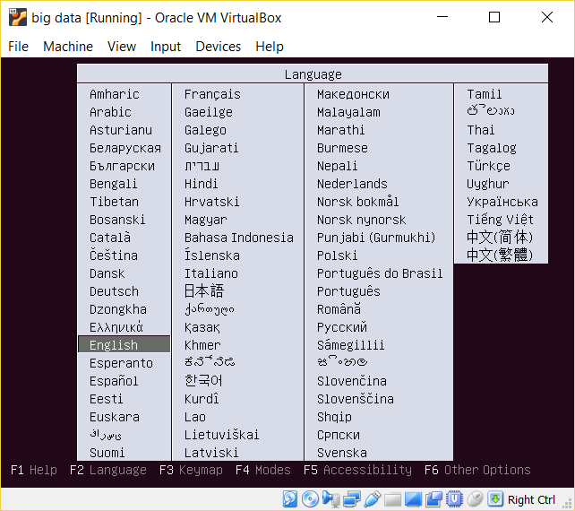
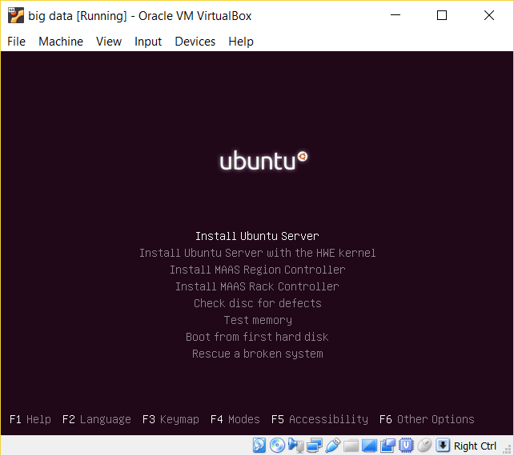
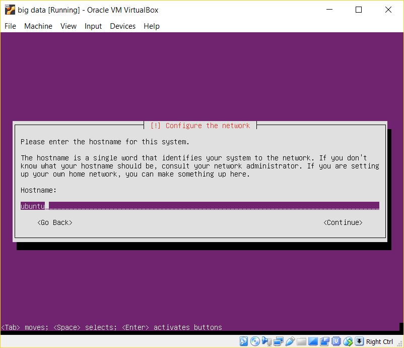
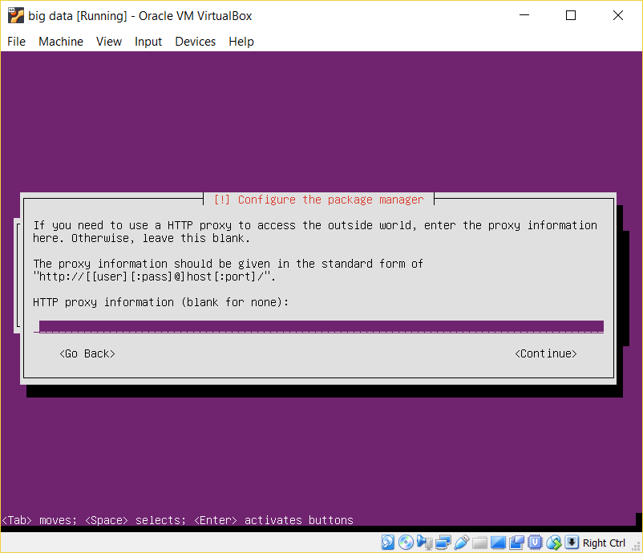
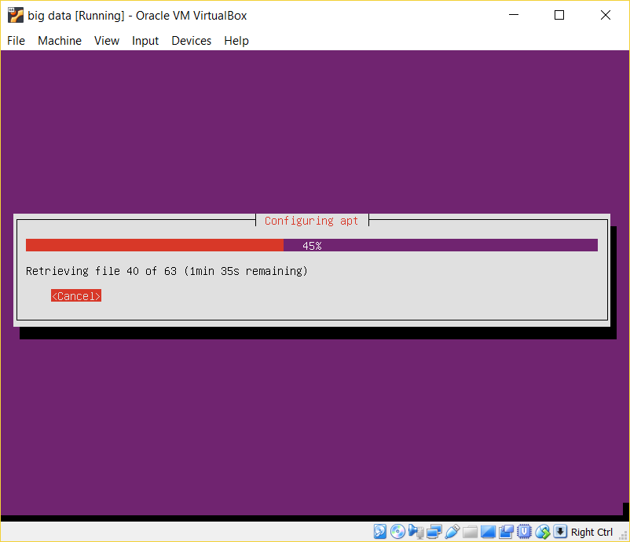

# Ubuntu Server
The following instruction is based on this link https://topnetworkguide.com/install-ubuntu-server-16-04-virtual-box/
1. Download Ubuntu Server 16.04.4 LTS from https://www.ubuntu.com/download/server
1. Then return to VirtualBox, select _big data_ and click _Settings_ -> _Storage_
1. Under _Controller: IDE_, select _Empty_ then click on the disk icon on the right and select the iso image of the Ubuntu Server that was downloaded in step 1 above. Click _OK_.\

1. Click _Start_ to power up the VM.
1. The first screen you see on boot up is language. Select _English_.\

1. Click _Install Ubuntu Server_.\

1. Select _English_ as the language the system will be setup with and select _Singapore_. Configure the keyboard layout.
1. The system proceeds to configure the network interfaces and the likes. Choose _enp0s8_ as the primary network interface.\

1. After the network interface has been configured successfully, you will be presented with the screen below. Enter the hostname for the machine as _ubuntu_. If the network interface is not successfully set up, repeat step 8 with the other network interface.\

1. Enter _bigdata_ as the username and _bigdata2018_ as the password.
1. In the setup user screen, choose _No_ to encrypting the home directory since this is a lab environment.
1. Choose _Singapore_ timezone.
1. In the partition disk, click _use entire disk and set up lvm_. Hit enter two times, click _Yes_ to writing changes. In the partition disk, hit continue and click _Yes_.\

1. Now the system will begin installation. This will take a while to complete.\

1. Leave blank and click _Continue_\

1. Wait for the setup to complete\

1. Click on _no automatic update_ as it will be done manually.
1. Accept the defaults as we do not need the server to perform these functions.\

1. Click _Yes_ to install grub bootloader to mbr as it is the only OS on the virtual machine.
1. At this point, you will be asked to reboot your system because the installation has been completed.\

